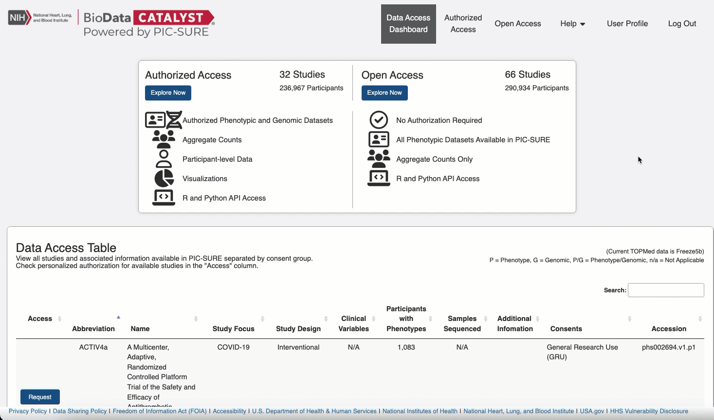

# NHLBI BioData Catalyst
For NHLBI research investigators who need to find, access, share, store, cross-link, and compute on large scale data sets, NHLBI BioData Catalyst will serve as a cloud-based platform providing tools, applications, and workflows to enable these capabilities in secure workspaces. BioData Catalyst is a rationally organized digital environment that will accelerate efficient biomedical research and maximize community engagement and productivity through increased access to NHLBI data sets and innovative data analysis capabilities. By making these data sets accessible and usable to varied users, BioData Catalyst will drive discovery and scientific advancement, leading to novel diagnostic tools, therapeutic options, and prevention strategies for heart, lung, blood, and sleep disorders.

https://biodatacatalyst.nhlbi.nih.gov/

Access to data: https://picsure.biodatacatalyst.nhlbi.nih.gov

# Grant information

As part of the BioData Catalyst Initiative, PIC-SURE development is funded by the following grant:
- “The development and integration of advanced cyberinfrastructure, leading-edge tools, and FAIR data to accelerate discovery by the NHLBI research community”
- Grant Number: OT3 HL 142480

# PIC-SURE_API BioData Catalyst examples

This folder contains various PIC-SURE API use-cases and illustration examples using BioData Catalyst studies. PIC-SURE API is available in two languages --R and python. PIC-SURE API requires R 3.4 or later, or python 3.6 or later.

## PIC-SURE API Overview

The main goal of the PIC-SURE API is to provide a simple and reliable way to work with restricted-access data from TOPMed and TOPMed related studies that are part of BioData Catalyst. Each individual study is accessible in a unique, easy to use, tabular format directly in an R or python environment. The API allows also to query studies subset, based on patients matching specified criteria, as well as to retrieve a cohort that has been created using the [PIC-SURE interface](https://picsure.biodatacatalyst.nhlbi.nih.gov). Finally, 43 specific phenotype variables that have been harmonized across multiple TOPMed studies are also accessible directly through the PIC-SURE API. 

## Get your security token

**In order to be able to run any one of these examples, you'll need to get a personal user security token**. This is the way the API grants access to individual users to protected-access data. **The user token is strictly personal, be careful not to share it with anyone**.

To get your token, process as follows:
1. In a web browser, open the PIC-SURE UI login page: https://picsure.biodatacatalyst.nhlbi.nih.gov/, and click on the 'eRA Commons' button to log in.
2. On the user-interface click on USER PROFILE
3. On the pop-up window, click on REFRESH and then COPY
4. Back into your Jupyter environment, create a text file called `token.txt` into the python and/or R folders and paste the token into it.

## Available notebooks

In each R and python folders, three example notebooks are available: 
- 1_PICSURE-API_101.ipynb: An illustration of the main functionalities of the PIC-SURE API.
- 2_How_to_do_a_PheWAS.ipynb: A straightforward PIC-SURE API use-case, using a PheWAS (Phenome-Wide Association Study) analysis as an illustration example.
- 3_HarmonizedVariables_analysis.ipynb: An example of how to access and work with the "harmonized variables" across the TOPMed studies.
- 4_Genomic_Queries.ipynb: An example of how to search using a variant numeric filter and variant categorical filter. 

## Contact

For bug report or additional information, please visit: https://biodatacatalyst.nhlbi.nih.gov/contact

